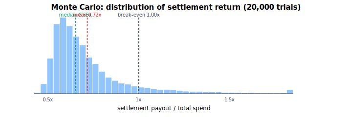
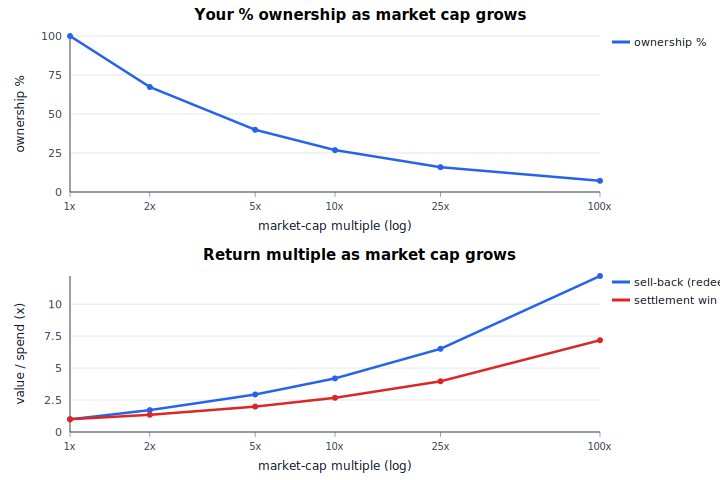

# 42 / Event Rush — Buyer Analytics Report

_Generated 2026-06-14 by `examples/build_report.py` from `examples/sample_market.json`._

Provenance tags: **[API]** exact from the 42 API · **[curve]** exact curve math · **[est]** estimate · **[you]** your assumption.

> ⚠️ This report is built from a **saved market snapshot** (the sandbox has no live API access). The curve (`p(x)=x^(3/4)/2,000,000`, verified vs `MC_Sim`) and the parimutuel settlement are exact; the **0.8% protocol fee is the documented value** and 42's **dynamic redemption tax is not modelled**, so exit/redeem figures are approximate.

## 1. Market summary  [API]

- **Title:** MCI vs CRY - match result
- **Ref:** `0x42aa00000000000000000000000000000000cd42`
- **Status:** live · **Collateral:** USDT · **Outcomes:** 3
- **Current total pot:** **74,700.00 USDT**

## 2. Current outcomes  [API]

Implied probability = outcome market cap ÷ total pot.

| Outcome | Price | Market cap | Minted qty | Implied prob |
|---|--:|--:|--:|--:|
| MCI win | 0.0402 | 52,000.00 | 4,050,000.00 | 69.612% |
| Draw | 0.0251 | 18,500.00 | 2,010,000.00 | 24.766% |
| CRY win | 0.0121 | 4,200.00 | 820,000.00 | 5.622% |

## 3. Buyer plans analysed  [curve / you]

All plans use the documented **0.8% protocol fee** and **0.50 USDT gas**. Buys mint from each outcome's current supply. ‘Payout if win’ is parimutuel: `your ownership × total pot`.

### Plan A — 300 USDT, equal split, uniform prior

Spread 300 USDT evenly across all outcomes; assume each is equally likely.

- **Total upfront spend:** 300.00 USDT  · **protocol fee:** 2.40 · **gas:** 0.5 · **total invested:** **300.50 USDT**
- **Pot after your buy:** 74,997.60 USDT
- **Expected ROI** (prior shown below): **0.93x** · **exit-now (approx):** 0.98x

| Outcome | Spend | Tokens | Your % | Payout if win | ROI if win | Break-even pot |
|---|--:|--:|--:|--:|--:|--:|
| MCI win | 100.00 | 2,197.16 | 0.054% | 40.66 | 0.14x | 554,208.25 |
| Draw | 100.00 | 3,714.02 | 0.184% | 138.32 | 0.46x | 162,929.01 |
| CRY win | 100.00 | 7,256.77 | 0.877% | 657.89 | 2.19x | 34,256.37 |

### Plan B — 300 USDT, equal split, market-implied prior

Same buy as A, but expected ROI uses the **market-implied** prior (MCI win 69.612%, Draw 24.766%, CRY win 5.622%).

- **Total upfront spend:** 300.00 USDT  · **protocol fee:** 2.40 · **gas:** 0.5 · **total invested:** **300.50 USDT**
- **Pot after your buy:** 74,997.60 USDT
- **Expected ROI** (prior shown below): **0.33x** · **exit-now (approx):** 0.98x

| Outcome | Spend | Tokens | Your % | Payout if win | ROI if win | Break-even pot |
|---|--:|--:|--:|--:|--:|--:|
| MCI win | 100.00 | 2,197.16 | 0.054% | 40.66 | 0.14x | 554,208.25 |
| Draw | 100.00 | 3,714.02 | 0.184% | 138.32 | 0.46x | 162,929.01 |
| CRY win | 100.00 | 7,256.77 | 0.877% | 657.89 | 2.19x | 34,256.37 |

### Plan C — target 2% ownership in every outcome

Buy until you hold 2% of each outcome; cost is driven by the curve and each outcome's current size.

- **Total upfront spend:** 5,133.53 USDT  · **protocol fee:** 41.07 · **gas:** 0.5 · **total invested:** **5,134.03 USDT**
- **Pot after your buy:** 79,792.46 USDT
- **Expected ROI** (prior shown below): **0.31x** · **exit-now (approx):** 0.98x

| Outcome | Spend | Tokens | Your % | Payout if win | ROI if win | Break-even pot |
|---|--:|--:|--:|--:|--:|--:|
| MCI win | 3,789.78 | 82,653.06 | 2.000% | 1,595.85 | 0.31x | 256,701.26 |
| Draw | 1,112.14 | 41,020.41 | 2.000% | 1,595.85 | 0.31x | 256,701.26 |
| CRY win | 231.60 | 16,734.69 | 2.000% | 1,595.85 | 0.31x | 256,701.26 |

### Plan D — 300 USDT, contrarian (weighted to the underdog)

Custom allocation 1:1:4 toward **CRY win**, the lowest-priced outcome.

- **Total upfront spend:** 300.00 USDT  · **protocol fee:** 2.40 · **gas:** 0.5 · **total invested:** **300.50 USDT**
- **Pot after your buy:** 74,997.60 USDT
- **Expected ROI** (prior shown below): **0.35x** · **exit-now (approx):** 0.98x

| Outcome | Spend | Tokens | Your % | Payout if win | ROI if win | Break-even pot |
|---|--:|--:|--:|--:|--:|--:|
| MCI win | 50.00 | 1,098.69 | 0.027% | 20.34 | 0.07x | 1,108,003.35 |
| Draw | 50.00 | 1,857.65 | 0.092% | 69.25 | 0.23x | 325,444.98 |
| CRY win | 200.00 | 14,466.11 | 1.734% | 1,300.14 | 4.33x | 17,334.10 |

### Plan E — 300 USDT equal, with +200,000 USDT later capital

Same buy as B, but assume 200,000 USDT of later capital flows in (split by the implied prior) before resolution — diluting ownership and growing the pot.

- **Total upfront spend:** 300.00 USDT  · **protocol fee:** 2.40 · **gas:** 0.5 · **total invested:** **300.50 USDT**
- **Pot after your buy:** 74,997.60 USDT · **+later capital:** 274,997.60 USDT
- **Expected ROI** (prior shown below): **0.71x** · **exit-now (approx):** 0.98x

| Outcome | Spend | Tokens | Your % | Payout if win | ROI if win | Break-even pot |
|---|--:|--:|--:|--:|--:|--:|
| MCI win | 100.00 | 2,197.16 | 0.054% | 91.92 | 0.31x | 898,967.94 |
| Draw | 100.00 | 3,714.02 | 0.184% | 293.12 | 0.98x | 281,918.47 |
| CRY win | 100.00 | 7,256.77 | 0.877% | 1,357.67 | 4.52x | 60,866.64 |

## 4. Plan comparison

| Plan | Invested | Expected ROI | Payout if favourite wins | Payout if underdog wins |
|---|--:|--:|--:|--:|
| A | 300.50 | 0.93x | 40.66 (MCI win) | 657.89 (CRY win) |
| B | 300.50 | 0.33x | 40.66 (MCI win) | 657.89 (CRY win) |
| C | 5,134.03 | 0.31x | 1,595.85 (MCI win) | 1,595.85 (CRY win) |
| D | 300.50 | 0.35x | 20.34 (MCI win) | 1,300.14 (CRY win) |
| E | 300.50 | 0.71x | 91.92 (MCI win) | 1,357.67 (CRY win) |

**Reading it:** spreading evenly (A/B) makes you hold the winner whatever happens, but you also fund the losers — expected ROI is below 1.0x once fees are paid, so profit needs the pot to **grow** after you enter. Concentrating on the cheap underdog (D) raises the upside if it wins and the downside if it doesn't. Later capital (E) dilutes your ownership but enlarges the pot.

## 5. Distribution & growth charts

**Calibrated Monte Carlo** — settlement return over 20,000 trials with random house seeds (spanning current outcome caps), uneven later capital averaging the current pot, and a random winner drawn from the implied prior:



- Mean **0.72x**, median **0.65x**, 5th–95th pct **0.52x – 1.16x**, P(profit) **8.8%**.

**Ownership & return vs market-cap growth** (illustrative, offline curve model): your % ownership decays as growthᐟ and your return multiple rises with it.



## 6. Exit / redeem  [est — APPROXIMATE]

Selling back into the curve immediately recovers roughly the net you put in minus fees. For Plan B that is about **295.22 USDT** (0.98x of invested).

> **Warning:** 42 applies a **dynamic redemption tax/spread** that is **not implemented** here. Real exit value is lower than shown. Use `--redeem-tax-mode manual --manual-redeem-tax PCT` to stress-test your own estimate.

## 7. Assumptions & warnings

- **Curve [curve]:** 42 power curve `p(x)=x^(3/4)/2,000,000`; market cap = cumulative staked = reserve. Verified against `MC_Sim/parimutuel_sim/market.py`.
- **Settlement [curve]:** parimutuel — winners split the whole pot pro-rata (`payout_per_unit = pot / winning_supply`).
- **Fee [est]:** 0.8% protocol fee (documented; re-verify against live docs).
- **Redemption tax [est]:** dynamic tax NOT modelled → exit values approximate.
- **Prior [you]:** ‘market-implied’ = current pot shares; not a guaranteed probability. Uniform where stated.
- **Source [API-shaped]:** a saved snapshot, not a live API pull.

## 8. Reproduce

```bash
python examples/build_report.py            # regenerate this report
python -m mmn --market-json examples/sample_market.json --budget 300 \
    --winner-prior 0.696,0.248,0.056 --gas-usd 0.5   # one plan, live-style CLI
```

